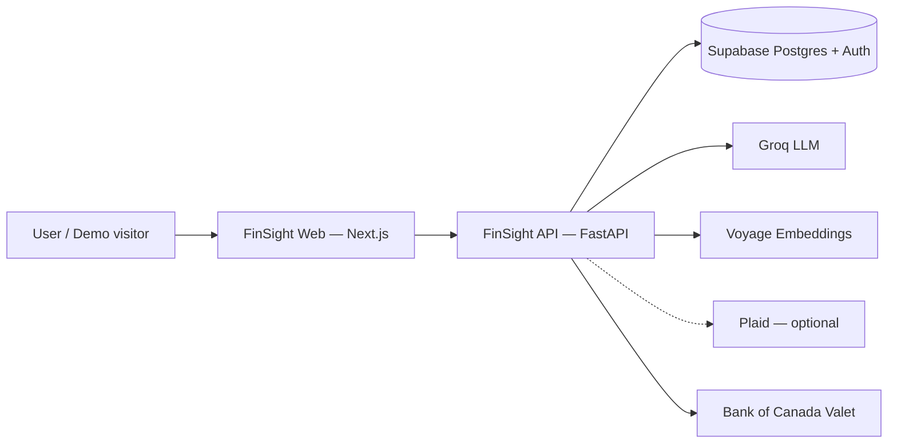

# FinSight AI — Architecture

> Pitch: *A Canadian finance agent that finds money you're losing, proves every number it shows, and never lets the LLM do the math.*

**Version:** see [`metrics.json`](./metrics.json) · **Status:** v2.0 in progress

## C4 — Context



## C4 — Container

| Container | Responsibility |
|-----------|----------------|
| Next.js frontend | Auth UI, dashboard, chat, leaks, planner, forecast, evidence drawer |
| FastAPI backend | REST + SSE chat, ingest, RAG, leak detectors, planning engines |
| PostgreSQL + pgvector | Relational data, embeddings, RLS, chat evidence |
| Background workers | Async ingest, FX rate refresh, demo reset, digests |

## Separation of concerns (non-negotiable)

```
Deterministic engines (Python)  →  numbers, projections, leak amounts
LLM (Groq / Claude / Ollama)    →  tool selection + explanation only
Guardrail                       →  every $ / % must appear in tool output
```

## Embeddings

| Provider | Model | Dimension |
|----------|-------|-----------|
| Voyage (default) | `voyage-4-large` | **1024** |
| Ollama (optional offline) | `nomic-embed-text` | 768 |

Production uses Voyage. Ollama is **not** a prerequisite.

## Data flow (chat)

1. User message → JWT scoped to `user_id`
2. LangGraph ReAct loop selects tools (SQL aggregates, search, leaks, planning, `calculate`)
3. Tool results get `evidence_id`s; draft answer tags amounts as `[[$412.30|ev_17]]`
4. Numeric guardrail verifies amounts; on failure, regenerate once or strip
5. Persist messages + evidence in `chat_sessions.messages_json`
6. Frontend renders clickable chips → evidence drawer

## Migrations (Alembic)

Head evolves with v2.0. Historical chain (newest last):

1. `603770f84793` — users, accounts, transactions
2. `a1b2c3d4e5f6` — transaction_embeddings + pgvector
3. `b2c3d4e5f6a7` — chat_sessions
4. `c3d4e5f6a7b8` — resize embeddings to 768 (Ollama era)
5. `d4e5f6a7b8c9` — auth_id on users
6. `e5f6a7b8c9d0` — user_id on chat_sessions
7. `f6a7b8c9d0e1` — HNSW index
8. `g7b8c9d0e1f2` — goals_json
9. `h8c9d0e1f2a3` — chat titles
10. `i9d0e1f2a3b4` — pinned sessions
11. `j0e1f2a3b4c5` — agent_profile
12. `k1f2a3b4c5d6` — Plaid bank_connections
13. `l2m3n4o5p6q7` — budgets + notifications
14. `m3n4o5p6q7r8` — category_rules
15. `n4o5p6q7r8s9` — resize embeddings to **1024** (Voyage)
16. `o5p6q7r8s9t0` — merchant_aliases
17. `p6q7r8s9t0u1` — fx_rates, leak_findings, audit_log, eval_runs

## Related docs

- [API](./api.md) · [Deploy](./deploy.md) · [Evals](./evals.md) · [Security](./security.md) · [ADRs](./adr/)
